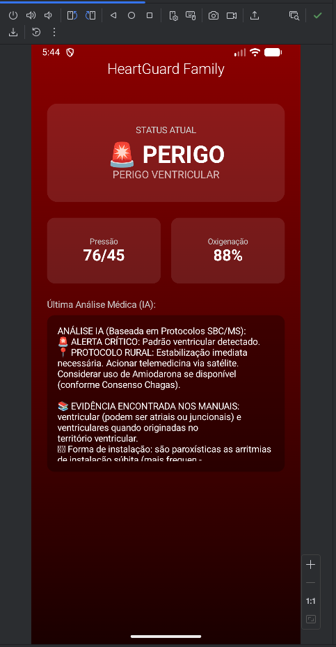
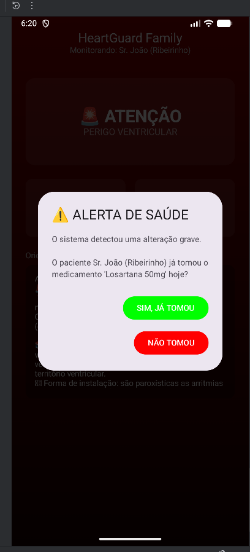
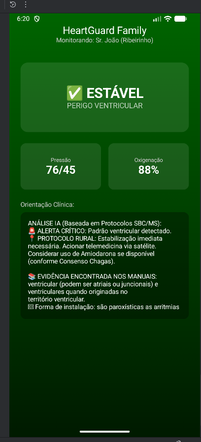
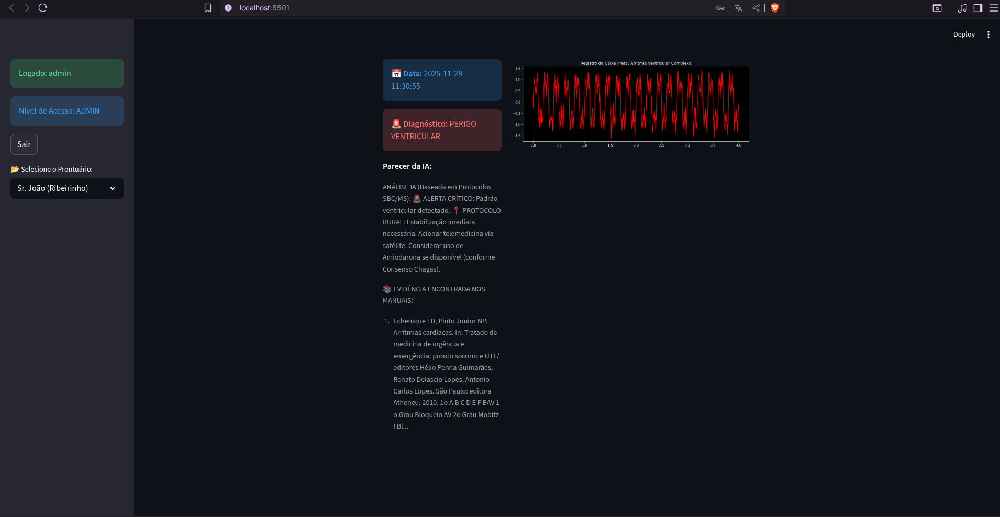
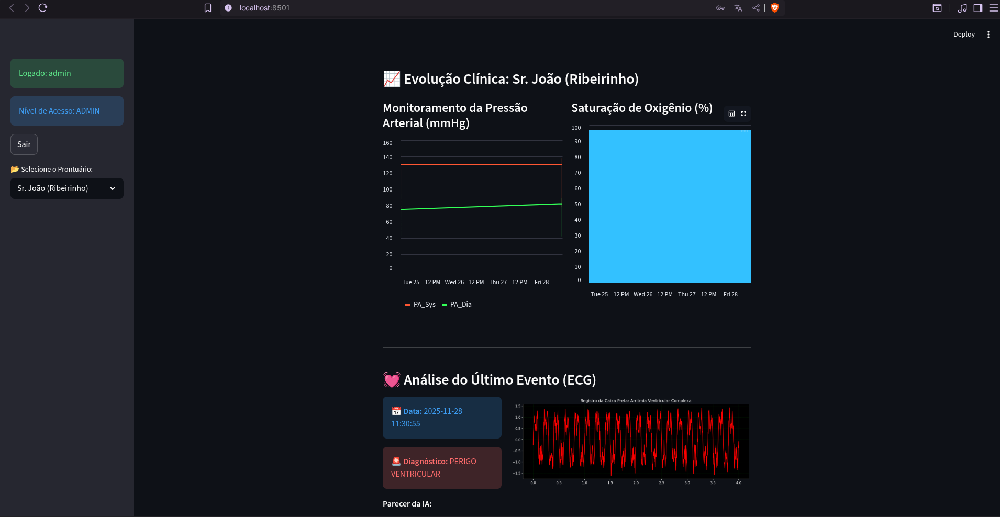
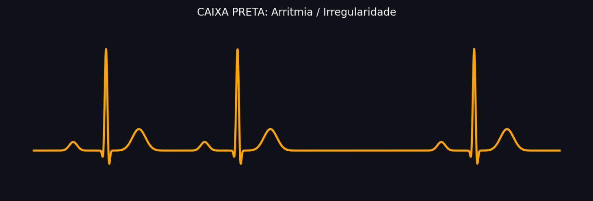
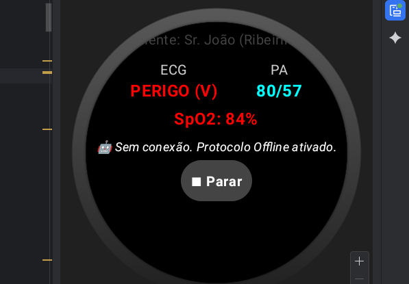

# 💓 HeartGuard: Sistema de Monitoramento Cardíaco com Edge AI e IoT

> **Projeto de Trabalho de Conclusão de Curso (TCC)** | Engenharia de Computação - UNIVESP
> **Autora:** Natália Ligabô dos Santos

---

## 📌 Sobre o Projeto

O **HeartGuard** é uma solução completa de *Internet of Medical Things* (IoMT) desenvolvida para salvar vidas em regiões remotas e desconectadas (como comunidades ribeirinhas).

O sistema resolve o problema da latência no diagnóstico cardíaco integrando:
1.  **Wearable (Edge AI):** Smartwatch que roda uma Rede Neural (CNN) **offline** para detectar arritmias em tempo real, sem depender de internet.
2.  **Mobile App (Android):** Interface de gestão de crise para a família, com verificação de protocolos medicamentosos.
3.  **Backend (GenAI):** Dashboard com arquitetura **RAG (Retrieval-Augmented Generation)** que analisa a "Caixa Preta" do evento e gera laudos baseados em bibliografia médica oficial.

---

## 📸 Galeria do Sistema & Jornada do Usuário

### 1. O Fluxo de Emergência (User Journey)

O sistema guia o paciente do momento da crise até a estabilização:

1.  **Detecção:** O algoritmo identifica o padrão ventricular perigoso.
2.  **Alerta & Intervenção:** A família é notificada e o app verifica a adesão ao medicamento (protocolo rural).
3.  **Estabilização:** Após a intervenção, o sistema confirma a estabilidade e prepara telemetria.

| 1. Alerta Crítico | 2. Intervenção (Check) | 3. Estabilização |
|:-----------------:|:----------------------:|:----------------:|
|  |  |  |

---

### 2. Dashboard Médico & Monitoramento Contínuo

O sistema oferece duas visões cruciais para a equipe médica:

1.  **Análise Forense (RAG):** Explicação detalhada do evento cardíaco com base em IA e literatura.
2.  **Evolução Clínica:** Gráficos de Pressão Arterial e SpO2 integrados, permitindo correlacionar a arritmia com o histórico de comorbidades do paciente.

| Diagnóstico IA (Evento) | Histórico de Sinais Vitais |
|:-----------------------:|:--------------------------:|
|  |  |

> *Esquerda: A IA explica a arritmia. Direita: O médico visualiza a queda de saturação correlacionada ao pico hipertensivo.*

### 3. Edge AI & Resiliência (Offline First)

Arquitetado para "zonas de sombra". O modelo TFLite roda embarcado no processador do relógio.

| Input do Sinal (ECG) | Processamento Local (Sem Internet) |
|:--------------------:|:----------------------------------:|
|  |  |

> *À direita: O Watch detecta a perda de conexão e ativa o protocolo offline automaticamente.*

---

## 🛠️ Tecnologias Utilizadas

### 📱 Mobile & Wearable
* **Linguagem:** Kotlin (Android Nativo)
* **Interface:** Jetpack Compose / Wear OS
* **IA Embarcada:** TensorFlow Lite (TFLite) - *Inferência no dispositivo*

### 🧠 Backend & Inteligência Artificial
* **Linguagem:** Python 3.10
* **API:** FastAPI
* **Dashboard:** Streamlit
* **GenAI/LLM:** LangChain + FAISS (Vector Store para RAG)
* **Machine Learning:** TensorFlow/Keras (Treinamento da CNN)

---

## 📂 Estrutura do Repositório

* `/Backend`: Código da API, Motor RAG e Dashboard Web.
* `/Mobile_app`: Projeto Android Studio (Módulos `app` para relógio e `heartguardmobile` para celular).
* `/Notebooks`: Jupyter Notebooks de treinamento (Datasets MIT-BIH e CODE).
* `/assets`: Imagens e demonstrações do sistema.

---

## 🚀 Como Executar

### Pré-requisitos

* Android Studio Koala ou superior.
* Python 3.10+.

### Passos

1.  **Clone o repositório:**
   
2.  
    ```bash
    git clone [https://github.com/natalialigabo/Heartguard.git](https://github.com/natalialigabo/Heartguard.git)
    ```

3.  **Configuração do Backend:**
    ```bash
    cd Backend
    # Instale as dependências (Certifique-se de estar num venv)
    pip install -r requirements.txt
    
    # ⚠️ IMPORTANTE: Baixe as bases de conhecimento (PDFs)
    python setup_data.py
    
    # Execute o Dashboard
    streamlit run dashboard.py
    ```

4.  **Execução Mobile:**
    * Abra a pasta `Mobile_app` no Android Studio.
    * Sincronize o Gradle e execute nos emuladores (Wear OS Square API 30+ e Phone API 33+).

---
